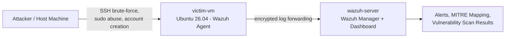

# Wazuh SOC Lab — SIEM Deployment, Detection & Vulnerability Assessment

A self-hosted Wazuh SIEM lab built to demonstrate end-to-end SOC analyst skills: deploying a manager/agent architecture, generating and detecting simulated attacks, mapping detections to MITRE ATT&CK, and performing a passive vulnerability assessment.

## Overview

This project simulates a small enterprise monitoring setup using [Wazuh](https://wazuh.com/), an open-source SIEM/XDR platform. A Wazuh manager was deployed and connected to a monitored Ubuntu endpoint, against which several real attack techniques were run to validate detection coverage — not just single-event log matching, but correlated, pattern-based detection.

**What this demonstrates:**
- SIEM deployment and agent enrollment (manager/agent architecture, networking, TLS)
- Log-based detection engineering and alert triage
- MITRE ATT&CK mapping and technique/tactic analysis
- Incident report writing in a professional analyst format
- Vulnerability assessment and remediation prioritization

## Architecture



## Techniques Tested

| Technique | MITRE ID | Tactic | Result |
|---|---|---|---|
| SSH password guessing | T1110.001 | Credential Access | Detected — Rule 5710, 5503, 5557 |
| Sustained brute-force (correlated) | T1110 | Credential Access | Detected — Rule 2502, **Level 10** |
| Sudo privilege escalation | — | Privilege Escalation | Detected — Rule 5402, 5403 |
| Unauthorized account creation | T1136 | Persistence | Detected — Rule 5902 |
| Passive vulnerability scan | — | — | 1,319 findings, 67 Critical |

Full detail, raw logs, and analysis are in [`reports/incident-report.md`](reports/incident-report.md).

## Key Findings

- **28 alerts** generated with a MITRE ATT&CK mapping across 6 tactics.
- Repeated failed logins successfully escalated from individual Level 5 alerts into a single **correlated Level 10 brute-force alert** — validating Wazuh's frequency-based detection, not just per-event logging.
- A simulated persistence technique (new local user creation) was correctly detected and mapped to **T1136 (Create Account)**.
- Passive vulnerability scan of the endpoint identified **67 critical** and **457 high**-severity CVEs, concentrated in the kernel image and Firefox packages.

## Repo Structure

```
.
├── README.md
├── reports/
│   └── incident-report.md          # Full write-up: timeline, detections, analysis, recommendations
└── evidence/
    ├── pdf/
    │   ├── wazuh-threat-hunting-report.pdf
    │   └── wazuh-mitre-attack-report.pdf
    └── screenshots/
        ├── dashboard-overview.png
        ├── agent-active-status.png
        ├── mitre-attack-module.png
        ├── vulnerability-detection-module.png
        └── correlated-brute-force-alert.png
```

## Tools Used

- **Wazuh 4.14.7** (manager + dashboard + agent) — self-hosted via OVA deployment
- **VirtualBox** — manager and victim endpoint virtualization
- **Ubuntu 26.04 LTS** — monitored endpoint OS

## Skills Demonstrated

`SIEM deployment` · `log analysis` · `MITRE ATT&CK mapping` · `incident response reporting` · `vulnerability assessment` · `Linux administration` · `network configuration`

---

*This is a self-directed lab project built for learning and portfolio purposes. All attacks were simulated against a personally owned, isolated lab environment.*
